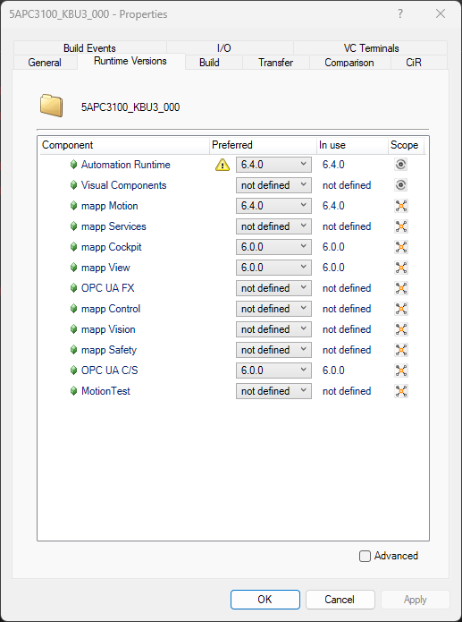

# mapp-robotics-tracking-sample

## Introduction
This sample serves as an introduction to the mapp Robotics tracking technology.

[DemoVideoOut.webm](https://github.com/user-attachments/assets/4cd81c92-82a7-4335-94d3-36d02113f416)

### Features
* 5 variants of a delta application
  * Standard pick&place
  * Pick&place with conditional stop
  * Pick&place with Multigripper
  * Pre-palletizing
  * Sorting of producs
* Automatic scene generation for Scene Viewer 6.x
  

## Requirements

* Automation Studio/Runtime 6.x
* mapp Motion 6.2
* Scene Viewer 6.1.x

## How-to
* [Download the last release](https://github.com/br-automation-com/mapp-robotics-tracking-sample/releases)↑ of project and open with AS
* Enable simulation, build and transfer the project. Wait for RUN.
* Open a watch window and use the ::ControlPanel:Input structure to start different scenarios
* Watch the action in Scene Viewer (User & Password: gmctest)

### Start application demo
To select an application add the variable ControlPanel to the watch window. 

The NC Programs (Track.st) are located directly in the project folder root. The file device reference is set to the FileDevices folder.

## Feature Details
| Title | Decription  | StartWith     |
|:------|:------------|:--------------|
| Sorting | While sorting, red an blue products are classified. The red products are placed on the outfeed belt and the blue products are placed at the fixed place.    |  |
| Pick and Place | The pick and place demo demonstrates picking a product from a moving belt and placing the product on another belt.    |  |
| Multipick | The Multipick-Example takes products from two different frame and places the products at a fixed place position.    |  |
| Conditional Stop | The conditional stop demo shows application with a fixed place position which may be locked with a conditional stop.  In the demo the position is locked every 1,5 seconds for 1,5 seconds.     |  |
| Pre Palletizing | During pre-palletizing the robot stays synchronized to one frame. The product is shifted with movement commands on that frame.    |  |

